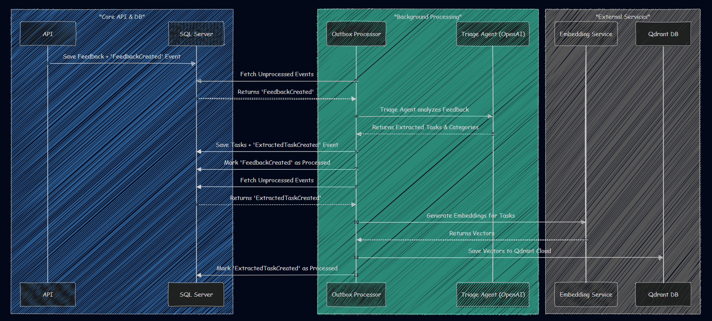
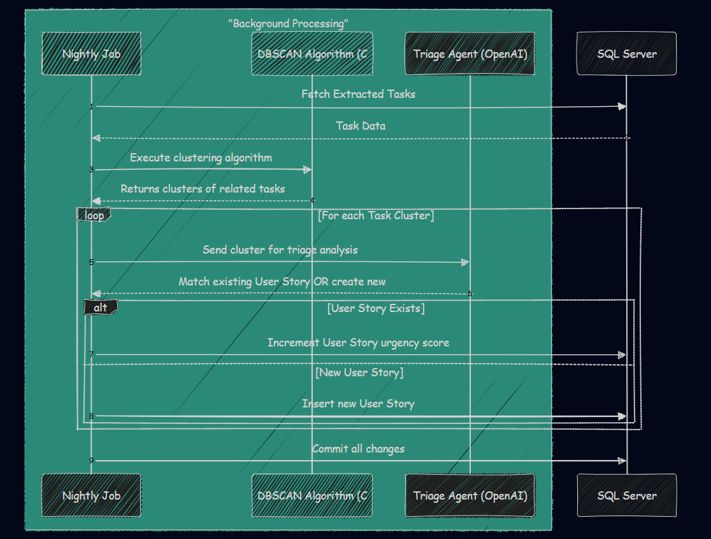

# FeedInsight Backend

FeedInsight is a robust backend system designed to manage and analyze customer feedback efficiently. It aggregates user feedback, intelligently clusters similar issues, automatically generates user stories, and synchronizes with Jira to streamline product management workflows.

## 🚀 Key Features

*   **Feedback Ingestion:** Collects customer feedback from various sources.
*   **AI-Powered Triage (OpenAI):** Uses LLMs to analyze and categorize feedback, extracting actionable tasks.
*   **Intelligent Clustering (DbScan & Qdrant):** Groups similar tasks together using vector embeddings and density-based clustering to identify common issues.
*   **User Story Generation:** Automatically generates comprehensive user stories from clustered tasks.
*   **Jira Integration:** Seamlessly creates and updates corresponding epics and stories in Jira Cloud.
*   **Background Processing:** Utilizes the Outbox pattern and background hosted services for reliable, asynchronous operations (e.g., nightly clustering).

## 🏗️ Architecture

The backend is built with **.NET (C#)** and adheres to the **CQRS** (Command Query Responsibility Segregation) pattern utilizing **Vertical Slice Architecture**. This ensures the codebase is highly cohesive, loosely coupled, and easy to maintain.

### High-Level Design
The system integrates with external services (Jira Cloud, OpenAI, Qdrant) via a robust infrastructure layer, driven by ASP.NET Core Hosted Services.

### Core Components
The architecture is divided into distinct layers (Presentation, Application, Domain, Infrastructure).

### Background Processing
The system relies on asynchronous background processing to handle expensive operations without blocking the API.

### Nightly Clustering Job
A scheduled nightly job runs the DBSCAN algorithm over vector embeddings to cluster similar tasks and generate user stories.

## 🛠️ Technology Stack

*   **Framework:** .NET (ASP.NET Core Web API)
*   **Database:** SQL Server (Entity Framework Core)
*   **Vector Database:** Qdrant Cloud
*   **LLMs & AI:** OpenAI API (GPT-4o), HuggingFace
*   **Integration:** Jira Cloud API
*   **Architecture Patterns:** CQRS, Vertical Slice Architecture, Outbox Pattern

## ⚙️ Getting Started

### Prerequisites
*   .NET SDK 10.0+
*   SQL Server
*   Qdrant Cloud Account
*   OpenAI API Key
*   HuggingFace API Key (Optional, for alternative embeddings)
*   Jira Cloud API Token

### Setup
1. Clone the repository.
2. Rename or copy `appsettings.json` to `appsettings.Development.json`.
3. Update `appsettings.Development.json` with your specific API keys, connection strings, and Jira credentials.
4. Run `dotnet restore` to install dependencies.
5. Apply Entity Framework migrations to set up the SQL database: `dotnet ef database update`
6. Run the application: `dotnet run --project src/FeedInsight.API`

## 🛡️ CI/CD

This repository includes a GitHub Action workflow to build and deploy to MonsterASP.NET via WebDeploy. Sensitive configurations are managed securely using GitHub Repository Secrets.